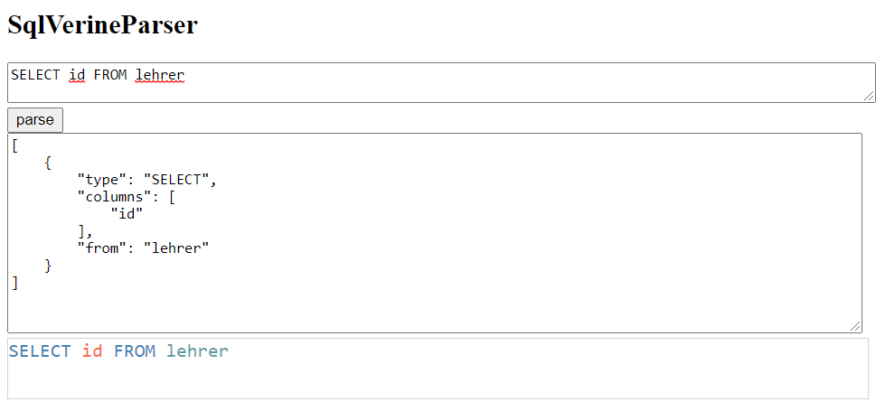

# SQLverine-parser



- start: `npm run start`
- build: `npm run build`

This project uses the simple JavaScript parser [peggy.js/peg.js](https://github.com/peggyjs/peggy) to parse custom SQLverine statements.

## peggy datei in js umwandeln
```
npx peggy src/sqlverine.peggy > sqlverine.js
```

## Links
- [SQLverine](https://github.com/Sulkar/SQLverine)
- [peggy.js online](https://peggyjs.org/online)
